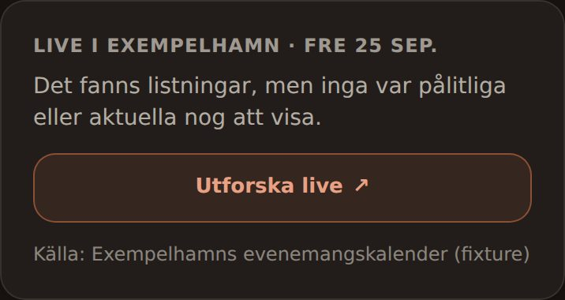
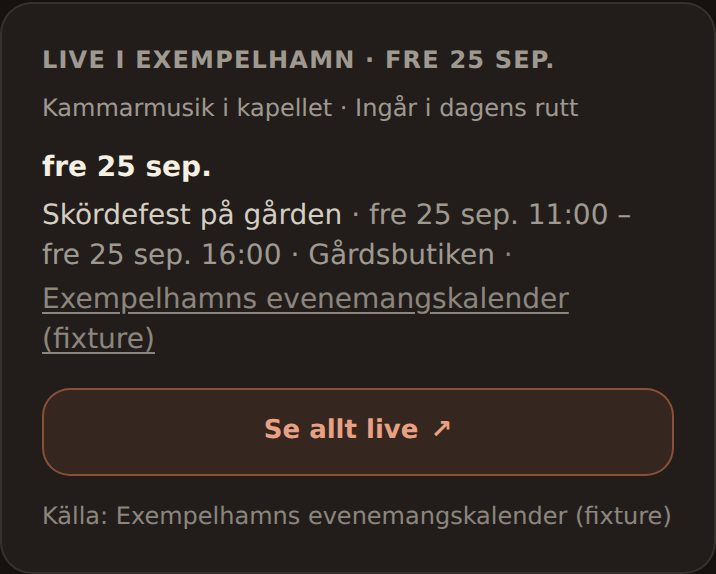
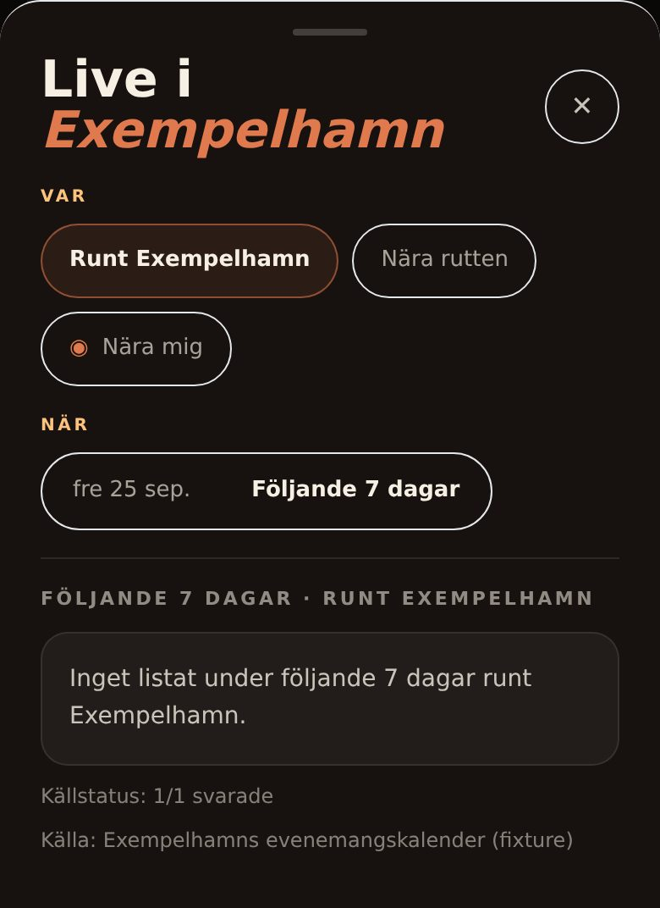
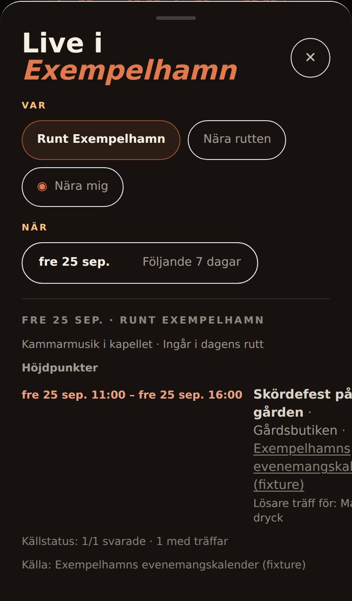
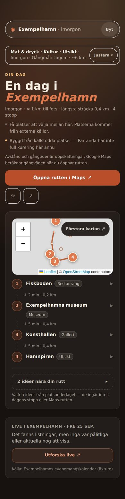
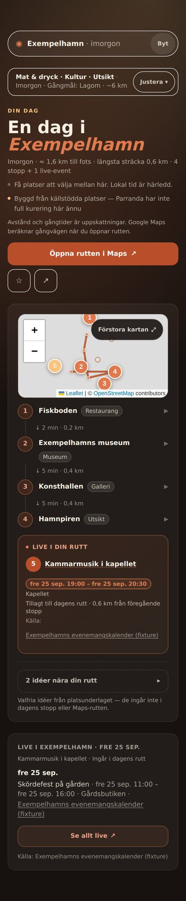
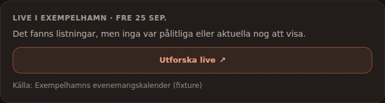
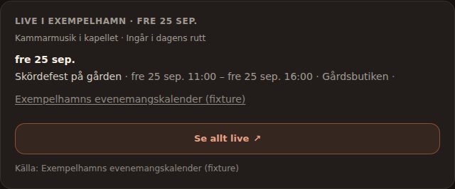

# Live: the venue budget follows the requested period

## Product change

Many approved calendars publish a venue name but no coordinates. The Wix
adapter never emits coordinates, and a Sitevision listing row gets them only
from one of at most six detail pages. Such a row can reach Live only when the
trusted venue resolver places it. That resolver may look up at most **four**
venues per collection (`DEFAULT_RESOLUTION_LIMIT`).

The four lookups were ordered by timing relative to the real clock:
`now` → `tonight` → `today` → `future`. For a plan made for tomorrow, this
evening's rows therefore took every lookup and were then thrown away by the
selected-date gate. Tomorrow's rows, whose venues the resolver could place,
were rejected as `missing_event_coordinates`. The Live panel then said:

> Det fanns listningar, men inga var pålitliga eller aktuella nog att visa.

That sentence was wrong twice. Tomorrow's listings were reliable, and the
evening rows were not rejected for trust but because they fell on another day.

Now every normalized row is assigned to the requested Live period before venue
resolution. With a selected date the period is that day plus the following
seven days. Without one it is the existing now-based tonight/this-week buckets.
The assignment uses the same bucket function as the final gate.

- Only rows inside the period may use the unchanged four-lookup budget, and the
  requested day's rows are looked up first.
- Rows outside the period never reach the geometry, fusion or display gates.
  They are counted in `out_of_period_event_count`, never as rejected evidence.
- When nothing is accepted and rows were only outside the period, source health
  says `no_events_in_requested_period`. The Planner then shows the existing
  credible-empty sentence: “Källorna svarade men listar inga händelser för
  perioden.” `all_event_evidence_rejected` now means that evidence **inside**
  the period failed a date-independent gate.
- On a warm read, rows accepted at collection whose occurrence has since ended
  are counted the same way.

## Telling empty answers apart

Each of these answers now has its own server fields. The client estimates
nothing.

| Answer | Server truth |
| --- | --- |
| No source covers the place | `coverage: "uncovered"` |
| A source did not answer | `source_health.status` `unavailable`/`partial`, per-source `failed` (see `LIVE_SOURCE_FAILURE_STATES.md`) |
| Sources answered, nothing listed for the period | `healthy`/`empty`, with `no_current_events_found` (no rows) or `no_events_in_requested_period` (rows only on other days, counted in `out_of_period_event_count`) |
| Listings for the period were rejected | `all_event_evidence_rejected`; `rejection_summary` counts in-period rows only |
| Accepted, but not in the first rows shown | `browse.<bucket>.more` and `hidden_count` |

One gap remains that no field can show: an event the source publishes but the
bounded adapter never fetched. Examples are a row past the first API page or a
Wix page outside the twelve most recently edited detail pages. Empty therefore
still means “nothing accepted from the evidence fetched”, never “nothing
happens”.

## Unchanged bounds and gates

No new source, fetch, provider call, key, approval, worker or city rule. The
lookup cap (4, maximum 8), the resolver's confidence and radius checks, fusion,
geometry, display, ranking and route-weave gates are unchanged. The selected
date stays user intent, not evidence. Normalization, freshness and cancellation
still use the actual clock.

The `agnostic-events-v6` namespace and its 20-minute TTL are unchanged. A pool
cached before this change reads as `out_of_period_event_count: 0` and expires
within the TTL.

One consequence is intended. A selected-day evening event that the budget
previously hid can now meet the existing weave gate. That gate requires source
backing, trusted coordinates, a cultural or salient evening row and walking
validation, and it may add the event to that day's route. Nothing about the gate
changed; it now sees the same evidence it would have seen with a correctly spent
budget.

## Evidence

Labels stay separate. Nothing here is provider or Pi acceptance.

**Deterministic, RED on `7c6884f` / GREEN on this change:**
`tests/live-period-venue-budget.test.js`, 5 of 5 fail on the base:

- For a tomorrow plan, the base looked up `Biblioteket, Hamnscenen, Kyrkan,
  Stortorget` (today's venues) and surfaced nothing. The change looks up only
  `Gårdsbutiken, Kapellet` and surfaces both rows.
- Six mapless rows, all today, for a tomorrow plan: the base spends four lookups
  and reports `all_event_evidence_rejected`. The change spends none and reports
  `no_events_in_requested_period` with six rows outside the period.
- Without a selected date, the base spent all four lookups on rows three weeks
  ahead, beyond the Live horizon, and rejected today's all-day market. The
  change looks up only that market.
- Guards: the cap stays at four when the selected day has six venues, and an
  in-period row that fails trusted geometry is still reported as rejected.

**Local browser, replay fixtures, not live evidence:** Chromium (Playwright
1.56) at 390×844 (DPR 2) and 1280×900, Europe/Stockholm, 24 September 2026
around 18:50. The real `buildApp` and committed `frontend/dist` ran for the
fictional place “Exempelhamn”, with injected place supply and a fixture venue
resolver. One fixture calendar in the reviewed localized-API shape listed four
mapless rows this evening and two tomorrow. Weather was a replayed Open-Meteo
shape. Every other request was refused. The SHA of each side comes from
`/api/health`: before `7c6884f`, after `e8611be`. Journey:
`/anywhere?place=Exempelhamn&prefs=food,culture,views&day=1&lang=sv`.

| | Before (`7c6884f`) | After (`e8611be`) |
| --- | --- | --- |
| Mobile, Live panel, tomorrow |  |  |
| Mobile, Live sheet, tomorrow |  |  |
| Mobile, whole page, tomorrow |  |  |
| Desktop, Live panel, tomorrow |  |  |

- Before, tomorrow: “Det fanns listningar, men inga var pålitliga …”. The sheet
  reads “Inget listat under följande 7 dagar” and “Källstatus: 1/1 svarade”.
- After, tomorrow: “Skördefest på gården” is listed and “Kammarmusik i kapellet”
  is woven into the route as “Live i din rutt”. The header's caveat line changes
  with that stop, from “Platserna kommer från externa källor” to “Lokal tid är
  härledd”.
- Today (`day` absent): panel and full-page captures are byte-identical on both
  sides ([panel](evidence/live-period-venue-budget/mobile-today-panel-unchanged.jpg)).
- No horizontal overflow on any capture. Failed requests were the same on both
  sides: Google Fonts and OpenStreetMap tiles refused by the sandbox proxy, and
  one superseded local request the app aborted. The first capture also logged
  one unnamed 404 on both sides; a request-level rerun did not reproduce it.

**Real providers and Pi: NOT OBSERVED.** This session's egress policy refuses
every reviewed provider host (CONNECT 403), the resolver and the Pi tunnel. The
misallocation's real-world frequency is unmeasured. It needs a reviewed source
whose mapless rows span more than four venues across two days.

## Exact-head QA handoff

1. Read `/api/health.build_sha`; it must equal the PR head.
2. Plan tomorrow in a place served by a mapless reviewed calendar, such as the
   Simrishamn/Österlen Sitevision and Wix rows. Record
   `acquisition.venue_resolution`, `rejection_summary`,
   `out_of_period_event_count` and the surfaced titles from the `live_events`
   sidecar. Compare with the base on the same day, cache and anchor.
3. Open at least two surfaced rows' source pages. Record the stated date,
   clock and venue against the card.
4. Plan today in the same place. The Live set must not lose rows that the base
   showed.
5. Pick a day on which the sources list nothing. The panel must say “Källorna
   svarade men listar inga händelser för perioden”, not the rejected-evidence
   sentence.

Report VERIFIED / FAILED / NOT OBSERVED separately. No deploy, source
activation or Pi change belongs to this PR, and #501 is untouched.
