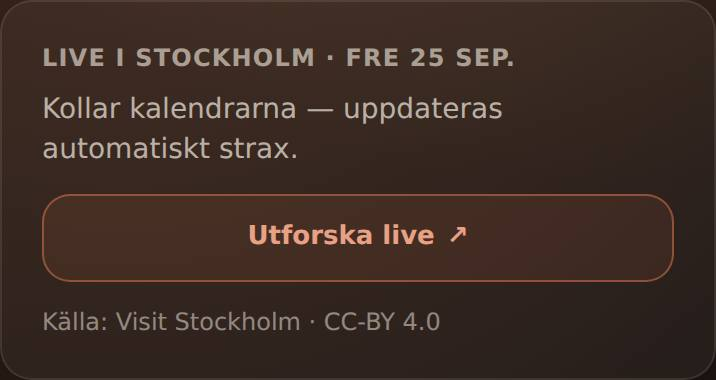
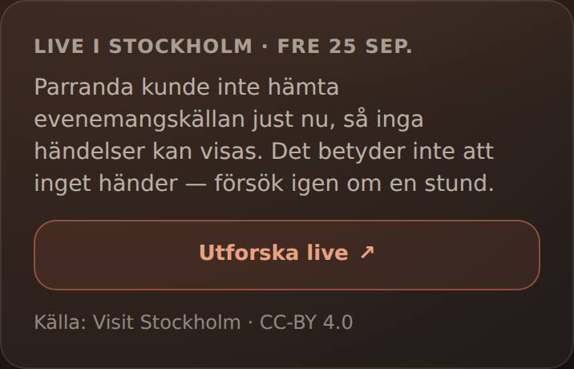
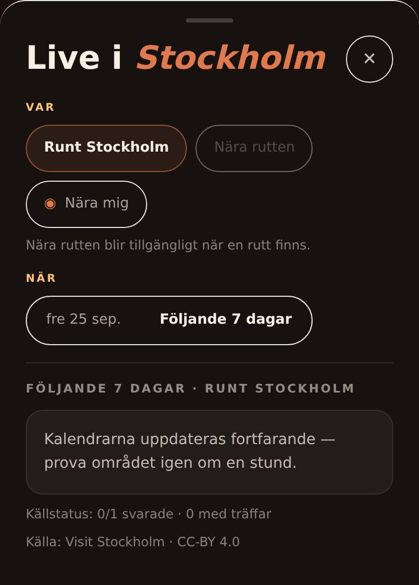
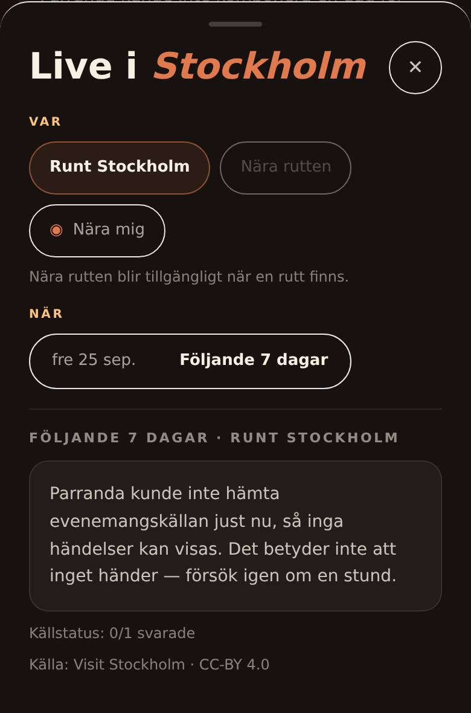
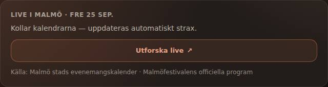
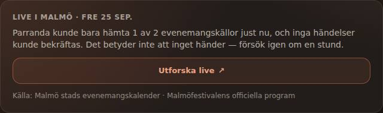
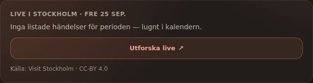
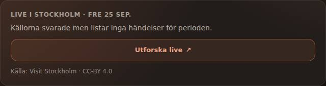
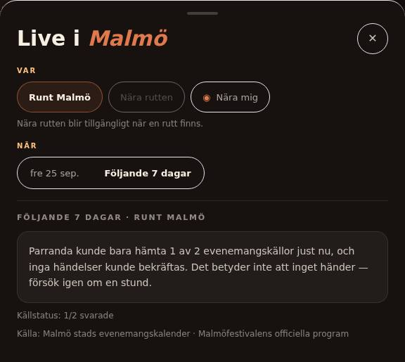

# Live: waiting, a credible empty answer and a source failure

## Product change

When Live shows no events, the user must be able to tell three different
answers apart. Before this change, one of them could not be expressed at all:
a source that had already failed was presented as an endless refresh.

| State | Server truth | Planner Live panel | Live sheet |
| --- | --- | --- | --- |
| Waiting | a refresh is running (`pending: true`) | “Kollar kalendrarna — uppdateras automatiskt strax.” | “Uppdaterar verifierade källor …” / “Kalendrarna uppdateras fortfarande …”; no responded counts |
| Credible empty | every selected source responded; nothing accepted for the period (cached as before) | “Källorna svarade men listar inga händelser för perioden.” | “Inget listat …” + “Källstatus: n/n svarade” |
| Source failure | the refresh finished, ≥1 selected source failed and nothing was accepted (`unavailable`, or `partial` with no events) | “Parranda kunde inte hämta evenemangskällan / någon av de N evenemangskällorna just nu …” or “… bara hämta k av N …”, plus “Det betyder inte att inget händer — försök igen om en stund.” | the same sentence + “Källstatus: k/N svarade” |
| Partial with events | ≥1 source failed, events accepted (cached as before) | events + existing incompleteness note | unchanged |

English copy mirrors the Swedish. Every count comes from the server's
`source_health`; the client estimates nothing.

## Root cause

A failed or partial-empty refresh is correctly never stored in the persistent
event cache, because the failure may be transient. It was, however, simply
discarded. The next read found no cached value, started another background
warm and answered `pending` again. Collection failed in well under a second,
yet every read said “still loading”. The Planner then re-composed the whole day
four more times (9/12/18/24 s follow-up ladder) before switching to “couldn't
verify”. Opening Live then ran three more pending queries and ended on “the
calendars are still updating”, a false instruction to wait. The independent
#505 review saw the same pattern live for Malmö (“still pending at the bounded
observation limit”). This change does not claim that was the same failing source.

## Contract

- A finished, covered refresh that the event cache refuses because a source
  failed is held in memory for **2 minutes** under the same event cache key
  (anchor bucket, hour, radius, spatial scope, source plan, selected date). It
  is served as that finished answer: `pending` absent, source health
  `unavailable`/`partial`, per-source `failed` statuses and reason tokens.
- No provider is fetched again for that key while the hold lasts. After it the
  next read retries once and answers honest `pending`. A success replaces the
  failure and is cached exactly as before; a new failure is held again.
- A collection that throws is held as every planned source failed
  (`source_collect_failed`). Nothing is invented.
- Holds are process-local, capped at 256 keys (oldest evicted), never persisted,
  never written to the `agnostic-events-v6` cache and never consulted when a
  cached result exists.
- Waiting never prints “0/N svarade”; counts describe finished collections.
- “· N med träffar” appears only when accepted events actually surfaced. A source
  that returned rows is not a hit: every row can still be rejected by the date,
  geometry or trust gates.

## Unchanged bounds and gates

No new source, provider call, fetch path, key, approval, worker, crawler or
city rule. Event cache TTL (20 min), `agnostic-events-v6`, the 30 s warm timeout
per provider, Live sheet retries (1.5/3/5 s) and the Planner follow-up ladder
are unchanged. The ladder now simply ends when the failure is known. Trust,
fusion, date, geometry and route-weave gates are untouched; the route and day
anchor are never affected. A failure is never a claimed empty calendar, and an
empty answer states what the responding sources list, not that nothing happens.

## Evidence

Labels are deliberately separate; none of this is Pi or real-provider acceptance.

**Deterministic (RED on `1be68a5`, GREEN on the change):**
`tests/live-failed-refresh.test.js` (6 of 7 fail on base: five because every
read stays `pending`, one because the classifier does not exist there; the
seventh is a key-scoping guard),
`frontend/tests/live-source-states.test.mjs` (mounted Planner, 4 of 4 fail on
base) and the `liveSourceFailure` cases in `frontend/tests/pulse-view.test.mjs`.

**Local browser, real reviewed manifest, provider hosts denied by the sandbox:**
Chromium (Playwright 1.56) at 390×844 (DPR 2) and 1280×900. Journey: Swedish
landing → “Stockholm, Sverige” or “Malmö, Sverige” → Mat & dryck + Kultur +
Utsikt → Imorgon (fre 25 sep 2026) → Live panel → Live sheet. Web environment
flags come from `compose.production.yml` (without Caddy/public guard). Place
lookup was replayed locally with Nominatim-shaped rows because the sandbox also
denies nominatim.org. Every reviewed source genuinely failed through the real
adapters (Visit Stockholm `source_http_403`; both Malmö sources failed). That is
a real failure path, **not** a provider outage observed on Pi. Place supply was
equally blocked, so neither side composed a route.

- Base `1be68a5`: “Kollar kalendrarna …” for ~84 s while the Planner re-composed
  four more times, then “Parranda kunde inte verifiera händelser just nu …”. The
  Live sheet ended on “Kalendrarna uppdateras fortfarande …” + “Källstatus: 0/1 svarade”.
- Change: the failure sentence at the first follow-up (~19 s), no further
  re-composes; the Live sheet showed the same sentence after one pending retry.

**Local browser, replay fixtures (not live evidence):** a Visit-Stockholm-shaped
replay page served either two fixture rows or an empty page. For Malmö, the
municipal row was replaced by an empty replay page of the same localized-API
shape while the real festival row failed, giving the partial-empty case. Base
stayed pending; the change reads “Parranda kunde bara hämta 1 av 2
evenemangskällor …”. Healthy-empty copy and fixture cards were compared too;
cards are unchanged.

Screenshots and their provenance are in
[`evidence/live-source-failure-states/`](evidence/live-source-failure-states/README.md):

| | Before (`1be68a5`) | After (`be19354`) |
| --- | --- | --- |
| Stockholm, mobile, Live panel at +20 s |  |  |
| Stockholm, mobile, Live sheet settled |  |  |
| Malmö partial (replay), desktop, panel at +20 s |  |  |
| Healthy empty (replay), desktop, panel |  |  |

Review case (rows returned, all rejected, one failed source; replay), desktop
Live sheet. `1a89f9b` still said “1 med träffar”; `be19354` does not:

| Review before (`1a89f9b`) | After (`be19354`) |
| --- | --- |
|  |  |

**Pi:** the public Pi tunnel was blocked by this sandbox's egress allowlist (curl,
Node fetch and WebFetch). The patch author therefore has **no** Pi or real-provider
observation of its own.

**Independent Pi review of `1a89f9b` (reported on #506, not re-observed here):**
an isolated localhost runtime on the Pi reported that exact head, used real
approved sources for 25 September and ran no deploy. Stockholm went `pending` → `healthy/events_found` (1/1)
after ~5 s. Malmö finished as `partial/empty` after ~10 s: 1/2 responded, and the
festival source returned `source_payload_invalid`. The mobile Planner journey
ended on the 1-of-2 sentence and the Live sheet stopped waiting. The review also
found “Källstatus: 1/2 svarade · 1 med träffar” while `accepted_event_count` was 0
(18 municipal rows, all rejected). The sub-count rule above corrects that.

## Remaining Live journey gaps (not changed here)

- A card's link text is the feed label (“Visit Stockholm”) while the localized
  API adapter links the organizer's `external_website_url`. The #504 record already
  shows a card labelled Visit Stockholm opening debaser.se. A site root is rendered
  exactly like an exact event page; nothing marks it as a generic homepage.
- The sheet heading “Höjdpunkter för dina val” also covers rows with
  `preference_match: "none"`; cards show no per-row reason.
- On narrow screens a selected-day timed card repeats the date twice
  (“fre 25 sep. 19:00 – fre 25 sep. 21:00”), and the timing column squeezes the
  title into a narrow strip.
- Reported by the independent Pi review: in Simrishamn, three recurring municipal
  entries were shown as “dagligen” on a selected Friday that was wrong for them.
  This is not a regression of this change, and it remains open.

## Exact-head QA handoff (Sol)

1. Read `/api/health` and record `build_sha`; it must equal the PR head. Test
   only where that is verified and deployment is authorized.
2. Source failure: use a real failing approved source if one occurs; otherwise
   run a controlled staging-only denial labelled as **fault injection**. First
   answer `pending`, then the failure sentence with correct k/N once the refresh
   finishes. No further follow-up composes, and the Live sheet must never say
   “uppdateras fortfarande” after the failure is known.
3. Hold expiry: after 2 minutes, reopening Live retries each provider once
   (count provider requests), then recovers to cards or holds the failure again.
4. Regressions: a healthy Stockholm (Visit Stockholm API) day still shows cards
   for today/tomorrow. A responding empty source shows the new empty sentence,
   and partial-with-events keeps events plus the incompleteness note. Check both
   viewports.
5. Open two real card links; record event page vs homepage (known gap above).
6. Report VERIFIED / FAILED / NOT OBSERVED / INVALID ACCEPTANCE separately.
   Replay/fixture runs are never live evidence.

No deployment, source activation, Pi change or #501 change belongs to this PR.
