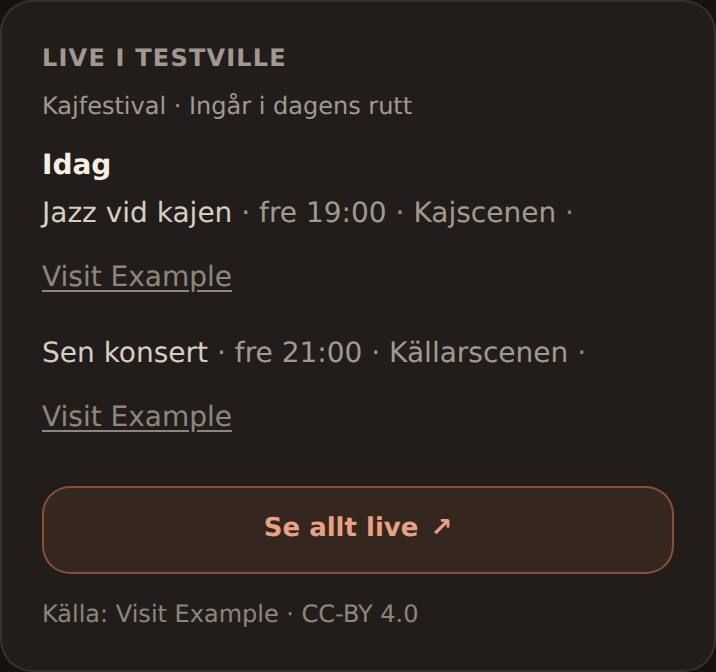
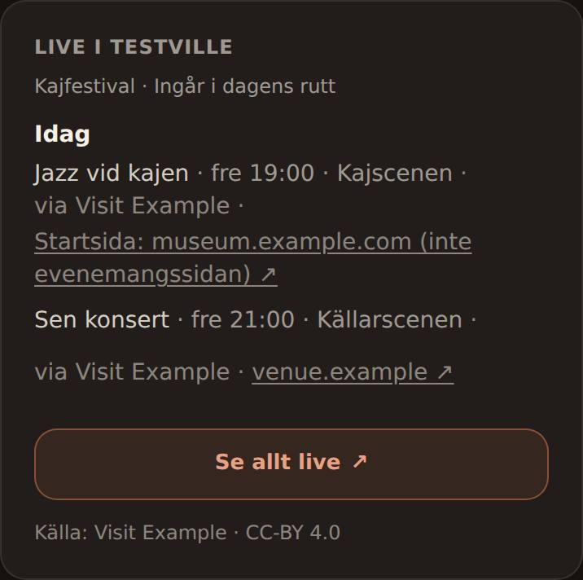
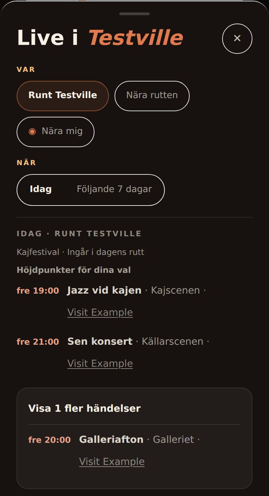
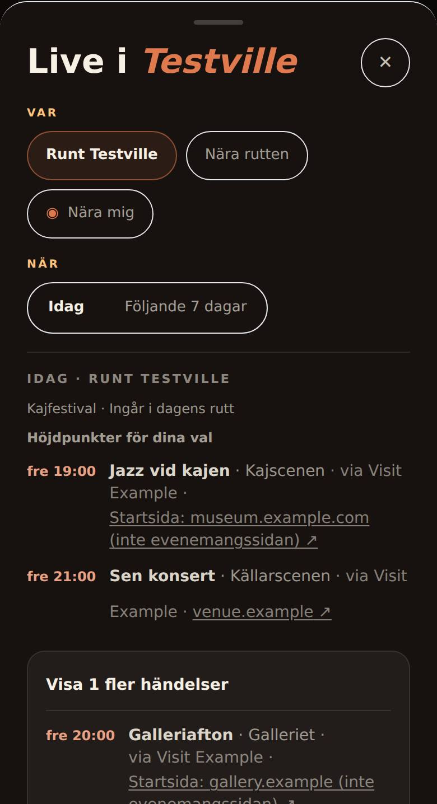
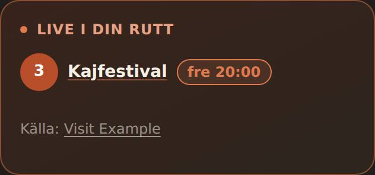
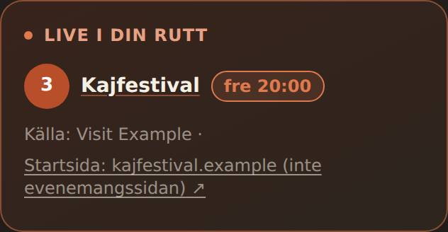
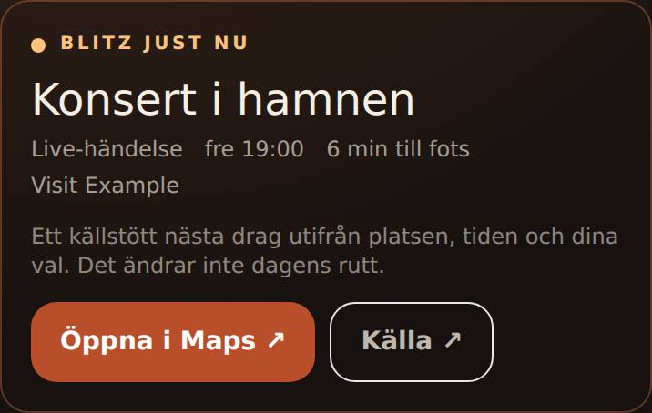
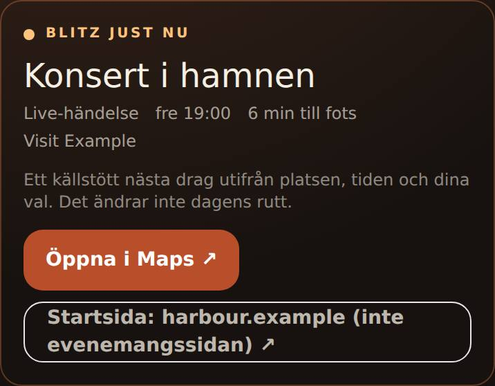
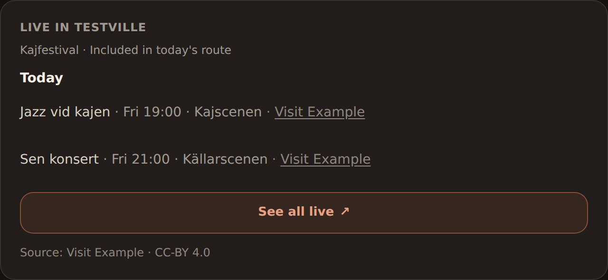
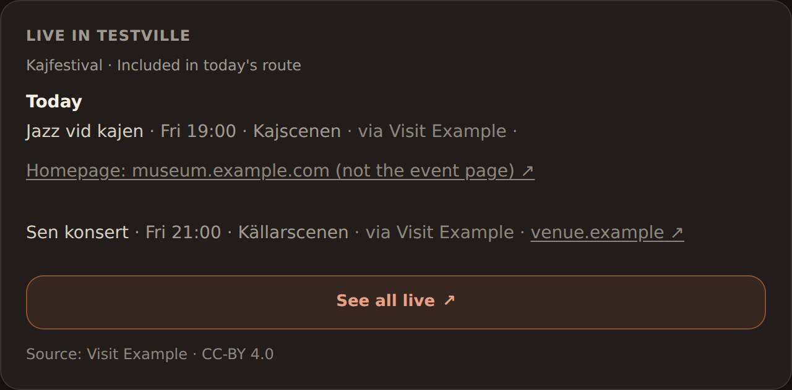

# Live source links say where they lead

## Product change

Every Live event row rendered its link as
`<a href={source_url}>{source_label}</a>`. The label is always the reviewed
**feed** (`applyReviewedSourceTrust`), while the URL is source-owned: the
localized-events API adapter links the organizer's `external_website_url`. The
#504 record (`LIVE_OCCURRENCE_CLOCKS.md`) shows a card labelled Visit Stockholm
opening debaser.se. When that URL is a site root, nothing distinguished it from
an exact event page. The route-woven event (“Källa: *feed as link*”) and the
Blitz Live move (a generic “Källa ↗” button) had the same flaw. The #506 Live
journey review recorded the gap in `LIVE_SOURCE_FAILURE_STATES.md`.

Links now name their destination host, and a site root says it is a homepage.
The feed stays visible as attribution, separate from the link.

| Surface | Before | After (Swedish copy; English mirrors it) |
| --- | --- | --- |
| Live panel row | link text “Visit Stockholm” | “via Visit Stockholm · **debaser.se ↗**”, or “via Visit Stockholm · **Startsida: museum.example.com (inte evenemangssidan) ↗**” |
| Live sheet highlights and “Visa fler” rows | same as the panel | same as the panel |
| Live i din rutt (woven stop) | “Källa: **Visit Stockholm**” | “Källa: Visit Stockholm · **debaser.se ↗**” (or the homepage wording) |
| Blitz Live move | button “Källa ↗” | button “debaser.se ↗” (or the homepage wording); the feed stays in the meta line |
| Feed attribution line | “Källa: Visit Stockholm · CC-BY 4.0” | unchanged |

English: “Homepage: museum.example.com (not the event page)”. The copy names
the host rather than “the organizer”: generically Parranda does not know who
owns the destination. The localized API supplies an external website, other
adapters link the publisher's own detail page, so the host is the fact the user
can verify.

## Contract

`server/pulse-sources/event-source-link.js` classifies a `source_url` without
fetching, rewriting or inventing anything:

- `site_home`: an absolute http(s) URL whose path is empty, `/`, or a single
  bare locale segment (`/sv`, `/en/`, `/en-GB`, `/sv_SE`), with no fragment and
  no query parameter other than `utm_*` campaign tags (the family event fusion
  already ignores when comparing URLs).
- `page`: any other absolute http(s) URL. This only means “not a site root”; it
  never claims the page is the event's own detail page. A query such as
  `/?p=123` or `/?id=42`, a fragment route (`/#/events/42`) or a second path
  segment stays `page`, so an event page is never labelled a homepage.
- `null`: missing, relative, unparsable, non-http(s) or credential-bearing
  (`https://visit.example@evil.example/`). No link is rendered.
- `source_link_host` is the WHATWG hostname without port or a leading `www.`.
  IDN hosts stay in their ASCII (`xn--`) form so a look-alike cannot render as
  the real domain.

Where it appears: every Live event view (`source_link_kind`,
`source_link_host`), the evening anchor (`place_structure.district_day.evening_event`),
the woven route stop (`source.link_kind`, `source.link_host`), the route
interrupt event, and a Blitz Live move (`source.link_kind`, `source.link_host`).
`source_url` and `source_label` keep their exact previous values.

Served Live rows recompute the classification from their own `source_url`, so
rows from an `agnostic-events-v6` pool written before this change are served
classified; the cache namespace and TTL are unchanged. The Planner reads only
the server's classification (`eventSourceLink` in `pulse-view.mjs`) and renders
a link only for a classified http(s) URL. A row without it, including a day
saved in the browser before this change, shows its “via” attribution with no
link rather than a guess; rebuilding the day restores the link.

## Unchanged bounds and gates

No new source, fetch, provider call, key, worker, crawler, or city/publisher
rule. No URL is rewritten, resolved, followed or replaced, and no detail URL is
recovered. Trust, fusion, date, geometry, ranking and route-weave gates are
untouched. The legacy registered-city shell (`script.js`) and its citypack
Pulse cards are a separate surface and are unchanged; its any-place Live panel
is unreachable because no server path enables that mode.

## Known limits

- A `page` link is only “not a site root”. It may lead to a calendar list or
  an unrelated page; Parranda does not verify page content.
- Start pages under other paths (`/index.html`, `/home`, `/sv/start`) stay
  `page` and show only the host: no homepage claim without certainty.
- Any single two-letter path segment, optionally with a region, counts as a
  locale root. A non-locale two-letter path (`/tv`) would be called a homepage.
- IDN hosts read as `xn--…`: safer against look-alikes, less readable.
- Where a feed only has an organizer homepage, Parranda can now say so but
  still cannot supply the event page. Organizer/feed time disagreements
  (`LIVE_OCCURRENCE_CLOCKS.md`) are untouched.

## Evidence

Labels are deliberately separate; none of this is Pi or real-provider acceptance.

**Deterministic (RED on `1be68a5`, GREEN on the change):**

- `tests/live-event-source-link.test.js`: classifier cases (site root, locale
  root, deep link, query-only, fragment, invalid/relative/non-http(s)/userinfo),
  the event view, the real localized-API adapter through `collectAnchorEvents`,
  a cached pool without the fields, both weaves plus the route interrupt, and a
  Blitz Live move. On base with only the classifier module copied in, 5 of 8
  fail (every wiring test); the 3 pure classifier tests pass.
- `frontend/tests/live-source-links.test.mjs` (mounted Planner): 4 of 4 fail on
  base, at their first link assertion. Base renders the homepage link as
  “Visit Example” in the English and Swedish panel, the woven stop's link as
  “Visit Example”, and the Blitz button as “Source”. The sheet case is
  asserted only on the change; the base sheet appears in the screenshots below.
- `eventSourceLink` cases in `frontend/tests/pulse-view.test.mjs` and the Live
  move passthrough in `frontend/tests/blitz-view.test.mjs`.

**Local browser, replay fixtures (not live evidence):** the real built Planner on
`1be68a5` and on this change's code head `e69feba`, same fixture, Playwright
Chromium. Only the Planner's own API calls were answered from fixture JSON.
Provenance and the fixture are in
[`evidence/live-source-links/`](evidence/live-source-links/README.md).

| | Before (`1be68a5`) | After (`e69feba`) |
| --- | --- | --- |
| Live panel, 390×844, Swedish |  |  |
| Live sheet with “Visa fler” open, 390×844 |  |  |
| Live i din rutt (woven stop), 390×844 |  |  |
| Blitz Live move, 390×844 |  |  |
| Live panel, 1280×900, English |  |  |

**Pi and real providers: NOT OBSERVED.** No real card was opened and no
provider host was contacted for this change.

## Exact-head QA handoff (Sol)

1. Read `/api/health` and record `build_sha`; it must equal the PR head. Test
   only where that is verified and deployment is authorized.
2. Real localized-API day (e.g. Stockholm): open at least two cards. Record the
   visible link text, the exact URL and what opened. A deep organizer link must
   read as its host; a site root, if one occurs, must read
   “Startsida: … (inte evenemangssidan)”. If no site root occurs, report the
   homepage case NOT OBSERVED rather than seeding one.
3. A municipal detail source (e.g. Malmö): detail links read as their host and
   open the same pages as before.
4. The woven route stop and the Blitz Live move where they occur; otherwise
   NOT OBSERVED.
5. 390×844 and desktop: the homepage wording wraps without hiding title, time
   or place.
6. Report VERIFIED / FAILED / NOT OBSERVED / INVALID ACCEPTANCE separately.
   Replay or fixture runs are never live evidence.

No deployment, source activation, Pi change or #501 change belongs to this PR.
