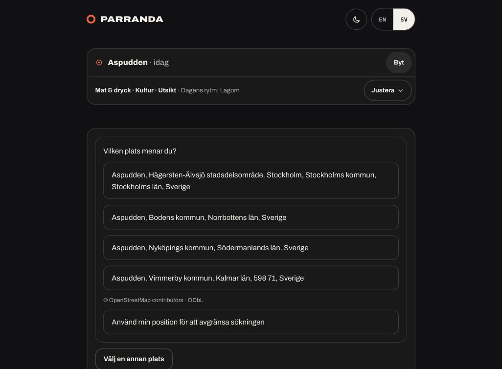

# Place recognition evidence — 2026-10-07

Owner: Codex (implementation/integration and runtime QA).
Base/GitHub main: `4b55cb091256e27a793f5c849f1c52b48c896ace`.
Frozen source/runtime QA: `132ed539e0b8ab5101347309981379aa97777206`.
The delivery commit adds documentation/evidence only; source equivalence is checked against this frozen SHA. Candidate/CI are recorded in the PR body.

## Before and after

The existing resolver could return several legitimate geographic candidates while Planner said it could not find the place. A qualified district could lose to a more popular station. Queries now match provider aliases and administrative qualifiers, including a city without a comma. Districts cannot deduplicate into nearby stations. Real remaining ambiguity becomes an explicit choice rather than a generic failure. A server-authenticated receipt preserves the choice across consumers. Place context is advisory; explicit GPS remains authoritative.

## Deterministic evidence

- Full `npm test` with the repository no-live-network guard and local Chrome: **3492 PASS, 3 skipped, 0 FAIL** (3495 total). This completed during final review corrections; do not attribute it to a later frozen head.
- After the review corrections: **346/346 affected backend/Planner tests PASS**; share delta **19/19 PASS**; final attribution/intake delta **52/52 PASS**. These cover the changed paths, including source-address venues, point-only Live context, station dedupe, malformed receipts, saved restore, debounce and stale Blitz cancellation.
- Frozen source `132ed53`: frontend **458/458 PASS**, `tsc --noEmit` PASS, Astro build PASS, committed dist guard PASS, self-hosted production contract validator PASS. Browser fixtures have no external network; these are synthetic acceptance evidence.
- Independent read-only Superpowers review: all findings resolved; no remaining material or minor finding. Final attribution delta independently verified too.
- Persistent key restart, HMAC tampering, query binding, expiry and explicit coordinate precedence have deterministic tests. No live geolocation was requested from the user during QA.

The first dependency installation ran out of local disk space; after reinstalling successfully, required tests used the installed dependencies and local Chrome. Initial missing-dependency/browser failures are environment failures, not product-regression evidence.

## Bounded real-provider/local browser QA

Frozen process bound only to `127.0.0.1:8129`; health reported the exact QA SHA and `local-place-recognition-qa`. Real rate-limited Nominatim resolver, committed frontend dist. Open-data loader, event supply, reviewed sources and weather acquisition were explicitly absent in this isolated harness.

**PASS criteria:** source-backed suburb/qualified district resolves; ambiguous query displays signed geographic choices and credits; selecting a choice removes ambiguity; rebuild, language change and Blitz retain its exact provider label without re-geocoding.

**Observed PASS:**

- `Montrouge` resolved medium with `nominatim_osm` provenance.
- `Aspudden, Stockholm` resolved the district, not the station.
- Bare `Aspudden` offered four geographic choices with OSM attribution/ODbL. Stockholm's district could be chosen.
- API selection and rhythm rebuild retained the exact chosen Swedish provider label; Blitz returned the same label. Native IAB UI showed choices, accepted the district and retained the choice on SV→EN navigation. No browser console errors.
- Only three provider searches in the final frozen process: the bare ambiguous query, suburb and qualified district. Selection, rebuild, language handoff and Blitz added none.

Names are verification examples, not production routing rules. This is a limited provider sample, not proof of worldwide provider coverage. [Structured observations](runtime.json) contain no receipts/secrets. [Actual built UI](choices.png):

## Observation limits and landing decision

- **Route/event supply: unverified here.** Providers were absent by design. UI honestly reported that it could not compose a day; this is not evidence of a supply regression, nor route acceptance.
- **Live selection: deterministic PASS only.** Scope, receipt and drift checks were tested with fixture event supply; no actual event provider matrix was rerun.
- The earlier shared tunnel displayed an engine failure for the suburb after geocoding succeeded. Cause remains unknown; external tunnel/runtime acceptance is **INCONCLUSIVE**. Local recognition success does not resolve that provider/server cause.
- Seven-day receipts survive process restarts only when `PARRANDA_CACHE_DIR` is writable/persistent. Without it, selection needs reconfirmation after restart. Multiple instances need the same selection key via that shared durable directory; deployment configuration is unchanged.
- Public Nominatim remains the existing low-volume provider. This PR does not establish high-volume provider capacity or deploy anything.
- Sharing a selected canonical label over200 characters is unavailable, rather than dropping qualifiers. Shared links resolve fresh; they are not identity receipts.

Landing decision: recognition capability is reviewable with local scoped PASS and honest supply limits; require green exact-head GitHub CI before merge. Merge/deployment are separate authorized actions. Existing deployment workflow follows successful main CI when its flag is enabled; this PR neither changes that coupling nor triggers it.

## Ownership / landing

Target `codex/place-recognition`, main-targeted PR. No source PR ancestry beyond main. Open UI workstreams #563 and #564 are excluded, not parents; they must reconcile overlapping frontend changes if merged later. #562 and #501 are also excluded. No dependent PR requires retirement.

Remaining condition: green exact-head CI, then reviewer approval/authorized landing. Codex owns CI follow-up and focused corrections; maintainer owns merge/deployment decision. Worktree, branch and QA artifacts are preserved.
